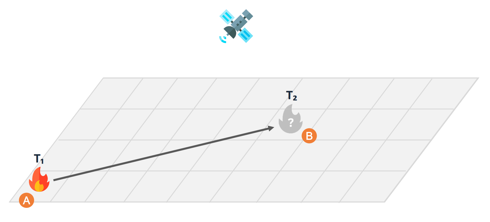
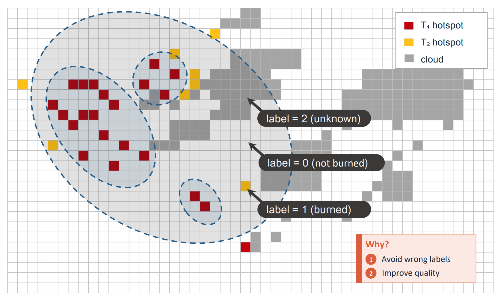
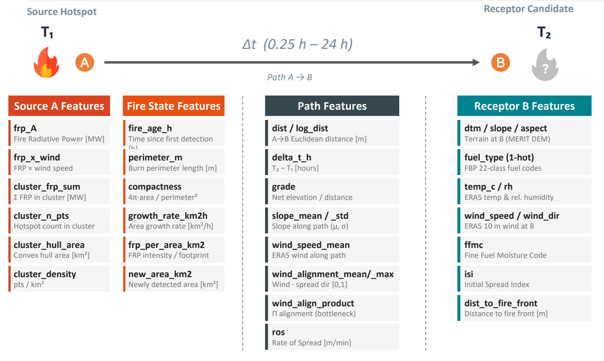
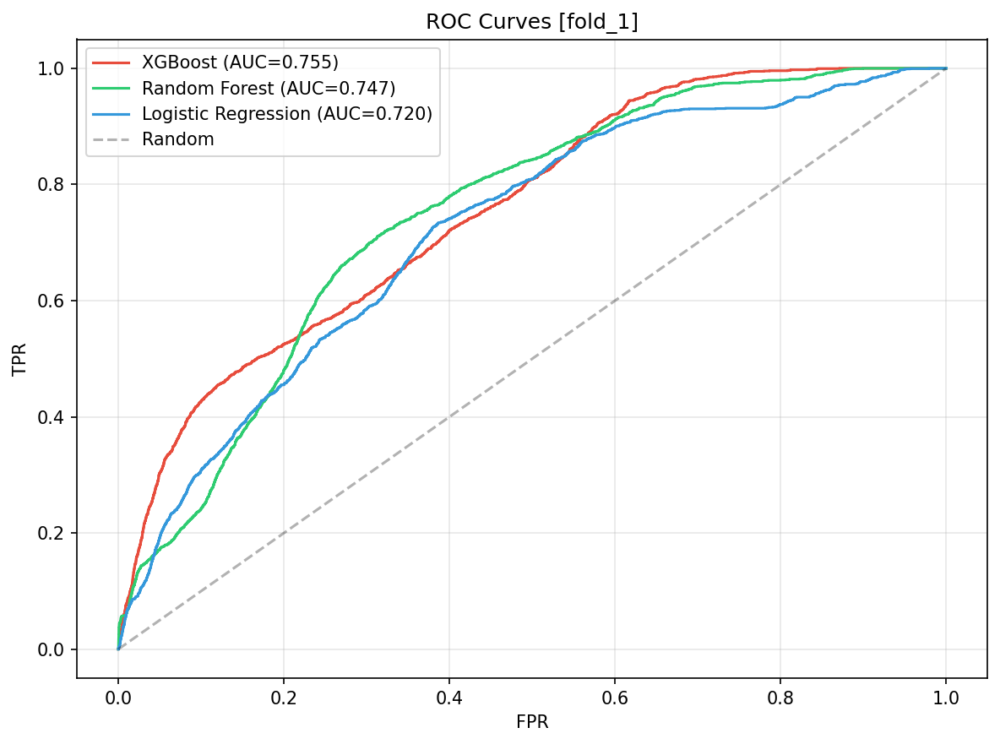
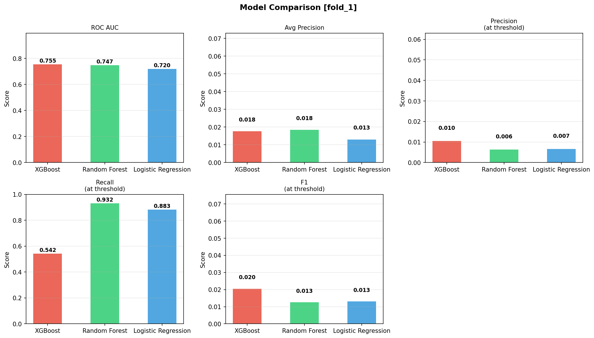
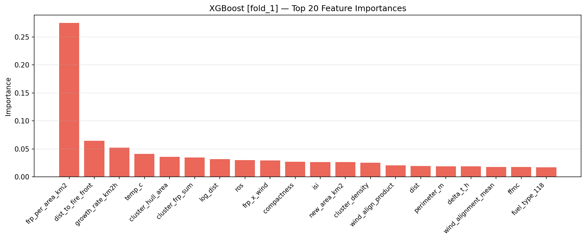
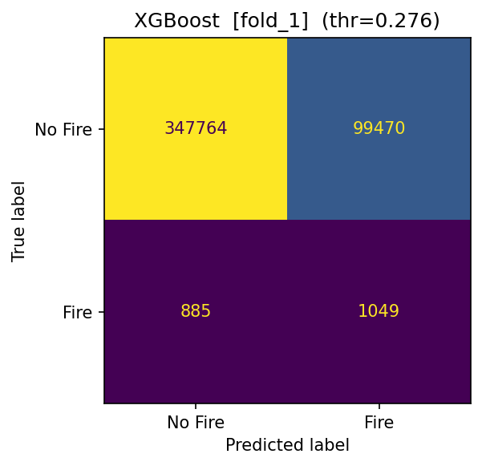

# Wildfire Hotspot Prediction

End-to-end machine learning pipeline for predicting wildfire spread at **500 m grid resolution**. The library integrates VIIRS satellite hotspot detections, ERA5 weather reanalysis, terrain/fuel-type rasters, and Canadian FBP fire weather indices to train binary classifiers that predict whether unburned grid cells will ignite within a given time window.

**Case study**: 2016 Fort McMurray wildfire, Alberta, Canada.

---

## How It Works

The model frames wildfire spread as a **source-receptor** problem across consecutive satellite overpasses:

<p align="center">
  
</p>

At time **T1**, active fire hotspots (**Source A**) are observed. At the next overpass **T2**, we ask: *will receptor cell **B** ignite?* The model predicts ignition probability for every candidate cell surrounding the fire front.

### Receptor Selection

A wind-driven **20 km buffer** around the fire perimeter (minus already burned area) defines the candidate receptor zone:

<p align="center">
  
</p>

### Labelling

Receptor cells are labelled using the T2 overpass observations. Cloud-obscured cells are excluded to avoid mislabelling:

<p align="center">
  
</p>

### Feature Engineering

**29 features** spanning fire state, weather, terrain, fuel type, FWI indices, and path-based wind alignment (+ fuel type one-hot encoded into 22 dummies, totaling 50 columns):

<p align="center">
  
</p>

| Category | Examples |
|---|---|
| **Fire state** | fire_age_h, perimeter_m, compactness, growth_rate_km2h, frp_per_area_km2 |
| **Weather** | temp_c, rh, wind_speed, wind_dir |
| **FWI** | ffmc (Fine Fuel Moisture Code), isi (Initial Spread Index), ros (Rate of Spread) |
| **Terrain** | dtm, slope, aspect |
| **Fuel type** | FBP classification (one-hot encoded) |
| **Path** | grade, slope_mean, wind_alignment_mean/max, wind_align_product |
| **Spatial** | dist_to_fire_front, ab_dist_m, delta_t_h |

---

## Pipeline

```
Collect  -->  Preprocess  -->  Build Training Data  -->  Train  -->  Predict  -->  Evaluate
```

```python
import wildfire_hotspot_prediction as whp

study = whp.define_study(
    name       = "fort_mcmurray_2016",
    bbox       = (-113.2, 55.8, -109.3, 57.6),
    start_date = "2016-05-01",
    end_date   = "2016-05-31",
)

whp.collect(study, firms_api_key="...", cds_key="...", earthdata_token="...")
whp.preprocess(study)
whp.build_training_data(study, n_folds=3)
whp.train(study, use_all_data=False)    # per-fold models
whp.predict(study)
whp.evaluate(study)
whp.train(study, use_all_data=True)     # full model for operational use
```

### Data Sources

| Source | Data | API |
|---|---|---|
| NASA FIRMS | VIIRS active fire hotspots | FIRMS API |
| Copernicus CDS | ERA5-Land hourly weather reanalysis | CDS API |
| NRCan | MRDEM-30 terrain (DTM, slope, aspect) | AWS COG |
| NRCan | FBP fuel type classification | HTTP |
| NASA CMR | VIIRS cloud masks (CLDMSK_L2) | CMR API |

---

## Results

Three classifiers are trained with **temporal k-fold** cross-validation (3 folds):

- **XGBoost** (primary)
- **Random Forest**
- **Logistic Regression**

### ROC Curves

<p align="center">
  
</p>

### Model Comparison

<p align="center">
  
</p>

### Feature Importance (XGBoost)

<p align="center">
  
</p>

### Confusion Matrix (XGBoost)

<p align="center">
  
</p>

> Results for all folds are available in `assets/fold_1/`, `assets/fold_2/`, and `assets/fold_3/`.

---

## Operational Inference

The trained full model can be used as a library for real-time prediction:

```python
from wildfire_hotspot_prediction import WildfirePredictor

predictor = WildfirePredictor(models_dir=Path("path/to/models"))
out_df = predictor.predict(feature_df, threshold=0.3)   # adds prob + pred cols
```

This is the interface consumed by the [wildfire-decision-support](https://github.com) system for operational situational awareness.

---

## Installation

```bash
git clone https://github.com/<user>/wildfire-hotspot-prediction.git
cd wildfire-hotspot-prediction
pip install -e ".[dev]"
```

### API Credentials

Create a `.env` file in the project root (or `tests/.env`):

```env
FIRMS_API_KEY=...          # NASA FIRMS
CDS_KEY=...                # Copernicus Climate Data Store
EARTHDATA_TOKEN=...        # NASA Earthdata Bearer token
```

### Visualization (optional)

An interactive deck.gl + MapLibre map is included for exploring predictions:

```bash
cd visualize
npm install
npm run build
cd ..
```

Then run the export server and open the map:

```python
whp.export_render(study)   # starts HTTP server on :8765
```

---

## Project Structure

```
wildfire-hotspot-prediction/
├── wildfire_hotspot_prediction/        # Main Python package
│   ├── collect/                        #   Stage 1: Raw data acquisition
│   ├── preprocess/                     #   Stage 2: Clean, reproject, derive indices
│   ├── training/                       #   Stage 3: Training dataset construction
│   ├── model/                          #   Stage 4: Model training & evaluation
│   ├── predict/                        #   Stage 5: Inference on held-out test sets
│   ├── build_prediction_data/          #   Operational inference (real-time)
│   ├── export/                         #   Stage 6: Export to GeoJSON + HTTP server
│   └── utils/                          #   Shared utilities (geo, raster, PROJ data)
├── models/                             # Pre-trained model artifacts
├── visualize/                          # deck.gl + MapLibre interactive map
├── tests/                              # Example usage scripts
├── assets/                             # Diagrams and evaluation plots
├── pyproject.toml
└── requirements.txt
```

---

## Key Design Decisions

| Decision | Rationale |
|---|---|
| 500 m grid | Matches VIIRS sensor pixel size |
| EPSG:3978 (NAD83 / Canada Atlas Lambert) | Equal-area projection for distance/area calculations |
| (T1, T2) overpass pair framework | Models fire spread over variable time windows (0.25 -- 24 h) |
| Forward-pass fire state accumulation | Correct boundary at any pair without re-computation |
| FFMC / ISI / ROS from Canadian FBP | Physics-informed fire weather features |
| Cloud exclusion | Cloud-obscured cells cannot be reliably labelled; excluded before training |
| Temporal k-fold | Splits on T1 timestamps to prevent temporal data leakage |

---

## Dependencies

**Python** >= 3.10

```
numpy, pandas, geopandas, shapely, pyproj, rasterio, scipy,
scikit-learn, xgboost, xarray, netCDF4, pyarrow, requests, h5py, tqdm, cdsapi
```

**Frontend** (optional): deck.gl 9, MapLibre GL 4, Vite 5

---

## License

This project is licensed under the [MIT License](LICENSE).

Developed as part of ENGO 645 (Data Mining) coursework at the University of Calgary.
